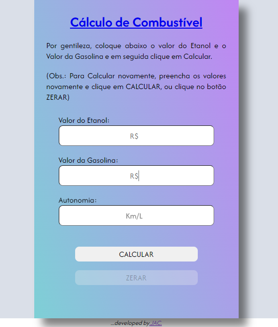

# Cálculo Combustível

<div align="center">
    
</div>

<div align="justify">

## Descrição

Com o preço do combustível elevado no Brasil, é essencial encontrar opções mais econômicas para abastecer nossos veículos. No entanto, às vezes o combustível mais barato não compensa, já que o etanol pode ser consumido mais rapidamente do que a gasolina.

Este projeto foi desenvolvido para auxiliar os motoristas a decidir qual combustível utilizar, considerando os valores inseridos nas lacunas. O código realiza os cálculos necessários e fornece a resposta mais vantajosa.

</div>

## Tecnologias Utilizadas

Este projeto foi construído com as seguintes tecnologias:

*  HTML
*  CSS
*  JavaScript

## Como Usar

1. **Clone o repositório**:
   ```bash
   git clone https://github.com/joaoacastro/calculocombustivel.git

2. **Abra o arquivo HTML**:
    - Localize o arquivo index.html e abra-o em seu navegador.

3. Insira os valores:
    - Preencha as lacunas com os valores do etanol e da gasolina.

4. Veja o resultado:
    - O código calculará automaticamente qual combustível é mais vantajoso.

## Fonte
[Notícias Automotivas](https://www.noticiasautomotivas.com.br/alcool-gasolina-calculo/)

## Agradecimentos

<div align="justify">
Obrigado por visitar meu projeto! 😉 Você pode conferir outros projetos que desenvolvi em meu GitHub, ou entrar em contato comigo através dos links abaixo.
</div>
<div align="center">
    <a href="mailto:joaoaccastro@gmail.com"></a> <a href="https://www.linkedin.com/in/joao-ac-castro" target="_blank"></a>
</div>