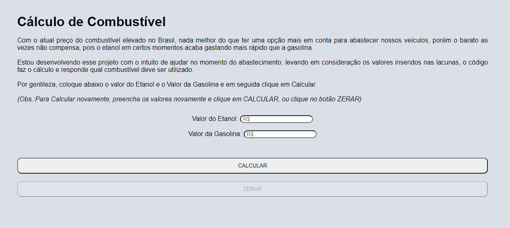

# Cálculo Combustivel
 

"
Com o atual preço do combustível elevado no Brasil, nada melhor do que ter uma opção mais em conta para abastecer nossos veículos, porém o barato as vezes não compensa, pois o etanol em certos momentos acaba gastando mais rápido que a gasolina.

Estou desenvolvendo esse projeto com o intuito de ajudar no momento do abastecimento, levando em consideração os valores inseridos nas lacunas, o código faz o cálculo e responde qual combustível deve ser utilizado.

#### Utilizando:

* 
* 
* 

fonte:
* https://www.noticiasautomotivas.com.br/alcool-gasolina-calculo/

## Thanks for visiting my project! 😉
You can check out other projects I've developed here on my GitHub, or contact me through the other links.

 
